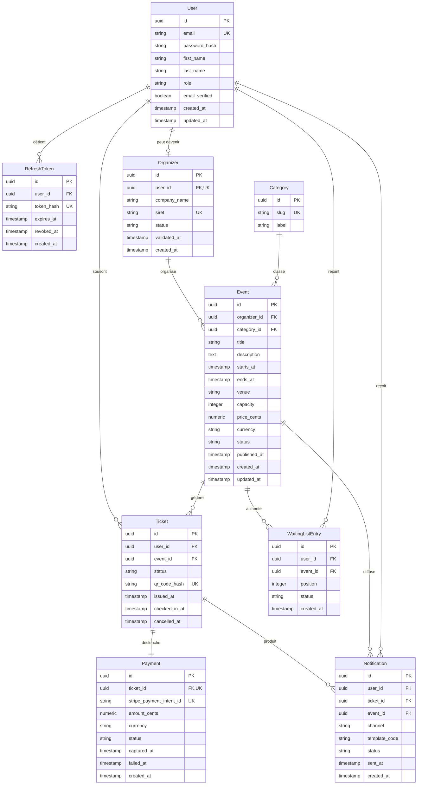

## §6.4 — Vue des données

##### Fait par Tom LEPRIEUR, Arthur L'AFFETER et Tiago DA COSTA

### Modèle entité-relation

Le modèle de données de SupEvents s'organise autour de six entités centrales qui supportent le cycle de vie complet d'un événement, depuis sa création par un organisateur jusqu'à la confirmation des inscriptions et l'envoi des notifications associées. Le diagramme ci-dessous formalise les agrégats et les cardinalités retenus pour la première version du produit. Les entités secondaires (`Category`, `RefreshToken`, `WaitingListEntry`) sont conservées car elles supportent des cas d'usage explicites du CDC : taxonomie d'événements, rotation des jetons d'authentification et gestion des listes d'attente lorsqu'un événement est complet. Les relations métier porteuses de sémantique fonctionnelle sont libellées explicitement (« souscrit », « organise », « déclenche ») pour lever toute ambiguïté de lecture.

Lecture du diagramme : `User` est l'entité racine ; un compte peut détenir plusieurs jetons de rafraîchissement et devenir un `Organizer` après validation administrative (relation 1-0..1). La relation `User ↔ Event` est volontairement indirecte : elle transite par `Ticket`, qui matérialise l'inscription comme un objet métier de plein droit (statut, traçabilité, QR code). `Payment` est en relation 1-1 stricte avec `Ticket` afin que tout règlement reste traçable à un et un seul billet. Les `Notification` sont rattachées au triplet `User / Ticket / Event` pour permettre des requêtes d'audit sans dénormalisation supplémentaire.

### Dictionnaire de données

#### Entité `User`

| Champ           | Type         | Contraintes                                                | Description                                        | Sensibilité RGPD |
|-----------------|--------------|------------------------------------------------------------|----------------------------------------------------|------------------|
| id              | UUID         | PK, NOT NULL, DEFAULT gen_random_uuid()                    | Identifiant interne du compte                      | Non              |
| email           | VARCHAR(254) | NOT NULL, UNIQUE, CHECK (email ~ format RFC 5322)          | Adresse e-mail de connexion                        | Oui              |
| password_hash   | VARCHAR(255) | NOT NULL                                                   | Empreinte Argon2id du mot de passe                 | Oui              |
| first_name      | VARCHAR(80)  | NOT NULL                                                   | Prénom déclaré par l'utilisateur                   | Oui              |
| last_name       | VARCHAR(80)  | NOT NULL                                                   | Nom déclaré par l'utilisateur                      | Oui              |
| role            | VARCHAR(20)  | NOT NULL, CHECK (role IN ('user','organizer','admin'))     | Rôle applicatif principal                          | Non              |
| email_verified  | BOOLEAN      | NOT NULL, DEFAULT false                                    | Validation par lien e-mail                         | Non              |
| created_at      | TIMESTAMP    | NOT NULL, DEFAULT now()                                    | Date de création du compte                         | Non              |
| updated_at      | TIMESTAMP    | NOT NULL, DEFAULT now()                                    | Date de dernière mise à jour                       | Non              |

Stratégie RGPD `User` : `email` stocké en clair (clé fonctionnelle de connexion) mais soumis à anonymisation après suppression du compte (remplacement par `deleted-{uuid}@anon.supevents`). `password_hash` : algorithme moderne à coût mémoire (Argon2id ou équivalent OWASP — paramètres précis à figer en § 9). `first_name` / `last_name` : durée de conservation à aligner sur la politique de rétention § 9 (hypothèse V1 : 36 mois après le dernier ticket émis, à valider). Aucune information n'est exposée dans les payloads d'événements asynchrones.

#### Entité `Organizer`

| Champ          | Type         | Contraintes                                                       | Description                                | Sensibilité RGPD |
|----------------|--------------|-------------------------------------------------------------------|--------------------------------------------|------------------|
| id             | UUID         | PK, NOT NULL, DEFAULT gen_random_uuid()                           | Identifiant interne organisateur           | Non              |
| user_id        | UUID         | FK → User.id, NOT NULL, UNIQUE                                    | Compte associé                             | Non              |
| company_name   | VARCHAR(160) | NOT NULL                                                          | Raison sociale                             | Non              |
| siret          | CHAR(14)     | NOT NULL, UNIQUE, CHECK (siret ~ '^[0-9]{14}$')                   | Identifiant légal entreprise               | Oui              |
| status         | VARCHAR(20)  | NOT NULL, CHECK (status IN ('pending','validated','revoked'))     | État d'instruction                         | Non              |
| validated_at   | TIMESTAMP    | NULL                                                              | Date de validation par l'administration    | Non              |
| created_at     | TIMESTAMP    | NOT NULL, DEFAULT now()                                           | Date de demande                            | Non              |

Stratégie RGPD `Organizer` : `siret` est traité comme donnée personnelle pour les entreprises individuelles ; conservation 10 ans par obligation comptable, puis purge.

#### Entité `Category`

| Champ | Type        | Contraintes                              | Description                  | Sensibilité RGPD |
|-------|-------------|------------------------------------------|------------------------------|------------------|
| id    | UUID        | PK, NOT NULL, DEFAULT gen_random_uuid()  | Identifiant interne          | Non              |
| slug  | VARCHAR(60) | NOT NULL, UNIQUE                         | Identifiant URL stable       | Non              |
| label | VARCHAR(80) | NOT NULL                                 | Libellé affiché              | Non              |

#### Entité `Event`

| Champ         | Type           | Contraintes                                                                          | Description                                | Sensibilité RGPD |
|---------------|----------------|--------------------------------------------------------------------------------------|--------------------------------------------|------------------|
| id            | UUID           | PK, NOT NULL, DEFAULT gen_random_uuid()                                              | Identifiant interne                        | Non              |
| organizer_id  | UUID           | FK → Organizer.id, NOT NULL                                                          | Organisateur propriétaire                  | Non              |
| category_id   | UUID           | FK → Category.id, NOT NULL                                                           | Catégorie de classement                    | Non              |
| title         | VARCHAR(160)   | NOT NULL                                                                             | Titre public                               | Non              |
| description   | TEXT           | NOT NULL                                                                             | Description longue                         | Non              |
| starts_at     | TIMESTAMP      | NOT NULL                                                                             | Date / heure de début                      | Non              |
| ends_at       | TIMESTAMP      | NOT NULL, CHECK (ends_at > starts_at)                                                | Date / heure de fin                        | Non              |
| venue         | VARCHAR(255)   | NOT NULL                                                                             | Lieu (adresse libre)                       | Non              |
| capacity      | INTEGER        | NOT NULL, CHECK (capacity > 0)                                                       | Nombre de places                           | Non              |
| price_cents   | NUMERIC(10,0)  | NOT NULL, CHECK (price_cents >= 0)                                                   | Prix en centimes                           | Non              |
| currency      | CHAR(3)        | NOT NULL, DEFAULT 'EUR', CHECK (currency ~ '^[A-Z]{3}$')                             | Devise ISO 4217                            | Non              |
| status        | VARCHAR(20)    | NOT NULL, CHECK (status IN ('draft','published','closed','cancelled'))               | État du cycle de vie                       | Non              |
| published_at  | TIMESTAMP      | NULL                                                                                 | Date de publication                        | Non              |
| created_at    | TIMESTAMP      | NOT NULL, DEFAULT now()                                                              | Date de création                           | Non              |
| updated_at    | TIMESTAMP      | NOT NULL, DEFAULT now()                                                              | Dernière mise à jour                       | Non              |

#### Entité `Ticket`

| Champ           | Type         | Contraintes                                                                                  | Description                          | Sensibilité RGPD |
|-----------------|--------------|----------------------------------------------------------------------------------------------|--------------------------------------|------------------|
| id              | UUID         | PK, NOT NULL, DEFAULT gen_random_uuid()                                                      | Identifiant du billet                | Non              |
| user_id         | UUID         | FK → User.id, NOT NULL                                                                       | Détenteur du billet                  | Oui (lien)       |
| event_id        | UUID         | FK → Event.id, NOT NULL                                                                      | Événement concerné                   | Non              |
| status          | VARCHAR(20)  | NOT NULL, CHECK (status IN ('reserved','confirmed','cancelled','refunded','checked_in'))     | État courant                         | Non              |
| qr_code_hash    | CHAR(64)     | NOT NULL, UNIQUE                                                                             | Empreinte SHA-256 du code de contrôle| Oui              |
| issued_at       | TIMESTAMP    | NOT NULL, DEFAULT now()                                                                      | Date d'émission                      | Non              |
| checked_in_at   | TIMESTAMP    | NULL                                                                                         | Date de pointage à l'entrée          | Non              |
| cancelled_at    | TIMESTAMP    | NULL                                                                                         | Date d'annulation                    | Non              |
|                 |              | UNIQUE (user_id, event_id) WHERE status <> 'cancelled'                                       | Un seul billet actif par couple      |                  |

Stratégie RGPD `Ticket` : `qr_code_hash` est dérivé d'un secret de scan + sel propre au billet ; le QR code lui-même n'est jamais stocké, il est régénéré à la demande pour limiter le risque de fuite.

#### Entité `Payment`

| Champ                       | Type           | Contraintes                                                                | Description                              | Sensibilité RGPD |
|-----------------------------|----------------|----------------------------------------------------------------------------|------------------------------------------|------------------|
| id                          | UUID           | PK, NOT NULL, DEFAULT gen_random_uuid()                                    | Identifiant du paiement                  | Non              |
| ticket_id                   | UUID           | FK → Ticket.id, NOT NULL, UNIQUE                                           | Billet associé                           | Non              |
| stripe_payment_intent_id    | VARCHAR(64)    | NOT NULL, UNIQUE                                                           | Référence Stripe                         | Oui              |
| amount_cents                | NUMERIC(10,0)  | NOT NULL, CHECK (amount_cents >= 0)                                        | Montant en centimes                      | Non              |
| currency                    | CHAR(3)        | NOT NULL, DEFAULT 'EUR'                                                    | Devise ISO 4217                          | Non              |
| status                      | VARCHAR(20)    | NOT NULL, CHECK (status IN ('pending','succeeded','failed','refunded'))    | État du règlement                        | Non              |
| captured_at                 | TIMESTAMP      | NULL                                                                       | Date de capture effective                | Non              |
| failed_at                   | TIMESTAMP      | NULL                                                                       | Date d'échec                             | Non              |
| created_at                  | TIMESTAMP      | NOT NULL, DEFAULT now()                                                    | Date de création                         | Non              |

Stratégie RGPD `Payment` : aucun PAN, aucun CVC, aucune date d'expiration ne sont stockés. Conformité PCI-DSS déléguée à Stripe via Stripe Elements + 3DS2. Seule la référence `stripe_payment_intent_id` est conservée ; le mécanisme de chiffrement au repos (algorithme et gestion de clés) est défini en § 9. Conservation 10 ans imposée par l'obligation comptable française (Code de commerce art. L123-22).

#### Entité `Notification`

| Champ          | Type         | Contraintes                                                                             | Description                          | Sensibilité RGPD |
|----------------|--------------|-----------------------------------------------------------------------------------------|--------------------------------------|------------------|
| id             | UUID         | PK, NOT NULL, DEFAULT gen_random_uuid()                                                 | Identifiant de la notification       | Non              |
| user_id        | UUID         | FK → User.id, NOT NULL                                                                  | Destinataire                         | Non              |
| ticket_id      | UUID         | FK → Ticket.id, NULL                                                                    | Billet rattaché (si applicable)      | Non              |
| event_id       | UUID         | FK → Event.id, NULL                                                                     | Événement rattaché (si applicable)   | Non              |
| channel        | VARCHAR(20)  | NOT NULL, CHECK (channel IN ('email','sms','push'))                                     | Canal de diffusion                   | Non              |
| template_code  | VARCHAR(60)  | NOT NULL                                                                                | Référence du modèle de message       | Non              |
| status         | VARCHAR(20)  | NOT NULL, CHECK (status IN ('queued','sent','failed','bounced'))                        | État d'expédition                    | Non              |
| sent_at        | TIMESTAMP    | NULL                                                                                    | Date d'envoi effectif                | Non              |
| created_at     | TIMESTAMP    | NOT NULL, DEFAULT now()                                                                 | Date de création                     | Non              |

Stratégie RGPD `Notification` : aucun corps de message n'est stocké, seul le `template_code` est conservé pour traçabilité ; les contenus sont reconstruits à la demande à partir du modèle versionné.

#### Entité `RefreshToken`

| Champ        | Type         | Contraintes                                  | Description                       | Sensibilité RGPD |
|--------------|--------------|----------------------------------------------|-----------------------------------|------------------|
| id           | UUID         | PK, NOT NULL, DEFAULT gen_random_uuid()      | Identifiant interne               | Non              |
| user_id      | UUID         | FK → User.id, NOT NULL                       | Compte porteur                    | Non              |
| token_hash   | CHAR(64)     | NOT NULL, UNIQUE                             | Empreinte SHA-256 du jeton        | Oui              |
| expires_at   | TIMESTAMP    | NOT NULL                                     | Date d'expiration                 | Non              |
| revoked_at   | TIMESTAMP    | NULL                                         | Date de révocation manuelle       | Non              |
| created_at   | TIMESTAMP    | NOT NULL, DEFAULT now()                      | Date d'émission                   | Non              |

Stratégie RGPD `RefreshToken` : seule l'empreinte hachée est stockée — le jeton brut n'est connu que du client. Rotation systématique à chaque usage, révocation totale à la déconnexion.

#### Entité `WaitingListEntry`

| Champ      | Type         | Contraintes                                                                    | Description                       | Sensibilité RGPD |
|------------|--------------|--------------------------------------------------------------------------------|-----------------------------------|------------------|
| id         | UUID         | PK, NOT NULL, DEFAULT gen_random_uuid()                                        | Identifiant interne               | Non              |
| user_id    | UUID         | FK → User.id, NOT NULL                                                         | Utilisateur en attente            | Non              |
| event_id   | UUID         | FK → Event.id, NOT NULL                                                        | Événement visé                    | Non              |
| position   | INTEGER      | NOT NULL, CHECK (position > 0)                                                 | Rang dans la file                 | Non              |
|            |              | UNIQUE (user_id, event_id)                                                     | Un utilisateur, une fois par évt. |                  |
| status     | VARCHAR(20)  | NOT NULL, CHECK (status IN ('waiting','promoted','expired'))                   | État courant                      | Non              |
| created_at | TIMESTAMP    | NOT NULL, DEFAULT now()                                                        | Date d'inscription en file        | Non              |

### Contraintes métier non triviales

Les contraintes ci-dessous ne se déduisent pas du diagramme ER ni des `NOT NULL` standards. Elles formalisent des invariants métier critiques pour l'intégrité du système.

| Entité           | Contrainte                                                                                       | Justification métier                                                              |
|------------------|--------------------------------------------------------------------------------------------------|-----------------------------------------------------------------------------------|
| `User`           | `role IN ('user','organizer','admin')`                                                           | Énumération fermée des rôles applicatifs ; tout autre rôle est un défaut de code  |
| `Organizer`      | `siret ~ '^[0-9]{14}$'`                                                                          | Format légal SIRET français — validation ancrée en base                           |
| `Organizer`      | `status IN ('pending','validated','revoked')`                                                    | Cycle de vie d'instruction explicite                                              |
| `Event`          | `ends_at > starts_at`                                                                            | Invariant temporel : un événement ne peut finir avant son début                   |
| `Event`          | `capacity > 0` et `price_cents >= 0`                                                             | Bornes métier élémentaires (jamais de capacité nulle, jamais de prix négatif)     |
| `Event`          | `currency ~ '^[A-Z]{3}$'` (ISO 4217)                                                             | Format devise normalisé                                                           |
| `Event`          | `status IN ('draft','published','closed','cancelled')`                                           | Machine à états explicite — transitions contrôlées par `EventService`             |
| `Ticket`         | `UNIQUE (user_id, event_id) WHERE status <> 'cancelled'`                                         | Un seul billet actif par couple utilisateur/événement (anti double-réservation)   |
| `Ticket`         | `status IN ('reserved','confirmed','cancelled','refunded','checked_in')`                         | Machine à états du billet                                                         |
| `Payment`        | `UNIQUE (ticket_id)`                                                                             | Un paiement par billet — pas de paiement orphelin ni de double-paiement           |
| `Payment`        | `amount_cents >= 0`                                                                              | Pas de paiement négatif (un remboursement est un statut, pas un signe)            |
| `WaitingListEntry` | `UNIQUE (user_id, event_id)`                                                                   | Un utilisateur ne peut pas occuper deux positions sur la même file                |
| `WaitingListEntry` | `position > 0`                                                                                 | Position 1-indexée, pas de zéro ni de négatif                                     |

Chacune de ces contraintes UNIQUE ou CHECK est rattachée à un code d'erreur API en § 8 (mapping 409 Conflict / 422 Unprocessable Entity), garantissant que les violations remontent un signal métier clair côté client plutôt qu'un 500 générique.

### Index stratégiques

Sont documentés ici uniquement les index résultant d'une décision d'architecture, justifiés par un cas d'usage volumique ou un objectif de latence (hypothèse de cible interne, à confronter aux SLA du CDC). Les index implicites des PK et FK ne sont pas listés.

| Entité      | Index                                                            | Justification                                                                                  |
|-------------|------------------------------------------------------------------|------------------------------------------------------------------------------------------------|
| `Event`     | `idx_event_published_starts_at (status, starts_at) WHERE status = 'published'` | Liste paginée du catalogue trié par date — requête la plus chaude (cible interne p95 sub-200 ms, à confirmer)         |
| `Event`     | `idx_event_search_gin` GIN sur `to_tsvector('french', title \|\| ' ' \|\| description)` | Recherche plein texte `/api/v1/events/search`                                                  |
| `Event`     | `idx_event_organizer (organizer_id, created_at DESC)`            | Tableau de bord organisateur — pagination antichronologique                                    |
| `Ticket`    | `idx_ticket_event_status (event_id, status)`                     | Comptage rapide des billets confirmés par événement (KPI temps réel + décrément de stock)     |
| `Ticket`    | `idx_ticket_user_issued (user_id, issued_at DESC)`               | Liste « mes billets » de l'utilisateur                                                         |
| `Payment`   | `idx_payment_status_created (status, created_at)`                | Réconciliation comptable et purge des PaymentIntent expirés                                    |
| `Notification` | `idx_notification_status_created (status, created_at)`         | Reprise des notifications en échec, fenêtre de retry                                           |
| `RefreshToken` | `idx_refresh_token_user_expires (user_id, expires_at)`         | Révocation en masse à la déconnexion + purge des jetons expirés                                |
| `WaitingListEntry` | `idx_waiting_event_position (event_id, position)`         | Promotion FIFO de la première entrée éligible (verrou applicatif Redis en complément)         |

### Stratégie de partitionnement et d'archivage

Hypothèse de dimensionnement V1 (à confronter au volume cible du CDC) : ordres de grandeur de l'ordre de quelques dizaines de milliers d'utilisateurs actifs et quelques milliers d'événements publiés par an, ce qui ne justifie pas de partitionnement physique dès la mise en service — PostgreSQL en instance unique avec réplication asynchrone est suffisant. La stratégie d'évolution est documentée par anticipation pour les paliers suivants :

- **`Notification`** : table à forte croissance (1 ligne par envoi, plusieurs envois par billet). Au-delà d'un seuil à confirmer en exploitation (ordre de grandeur : dizaines de millions de lignes), partitionnement déclaratif `RANGE` mensuel sur `created_at`. Archivage des partitions de plus de 24 mois vers S3 au format Parquet, table détachée puis supprimée.
- **`Payment`** : conservation 10 ans imposée par obligation comptable (Code de commerce art. L123-22). Partitionnement annuel `RANGE` sur `created_at` envisagé à partir de l'année 3 si la volumétrie le justifie. Aucun archivage hors-base avant la fin de l'obligation légale.
- **`Ticket`** : durée de conservation à aligner sur la politique RGPD § 9 (hypothèse V1 : 36 mois après la fin de l'événement, à valider). Mécanisme de purge proposé : job périodique d'anonymisation (rebascule du `user_id` vers un compte technique sentinelle) plutôt que suppression dure, pour préserver les KPI historiques de l'organisateur — décision à confirmer avec le DPO.
- **`RefreshToken`** : purge quotidienne des jetons expirés ou révoqués depuis plus de 30 jours.
- **Logs applicatifs** : hors PostgreSQL et hors périmètre § 6.4. La stack d'observabilité (collecte, stockage chaud/froid, rétention) sera tranchée en § 10 (exploitabilité).

### Stratégie de stockage

**PostgreSQL** héberge l'intégralité du domaine transactionnel : `User`, `Organizer`, `Event`, `Ticket`, `Payment`, `Notification`, `Category`, `RefreshToken`, `WaitingListEntry`. Le choix du relationnel est imposé par l'atomicité requise sur le triptyque inscription : décrément du stock de places + création du `Ticket` + ouverture du `Payment` doivent réussir ou échouer ensemble — seule une transaction ACID le garantit. PostgreSQL fournit aussi les contraintes d'unicité partielle (un seul billet actif par couple `user_id` / `event_id`) et l'extension `pgcrypto` pour la génération d'UUID v4 côté base. **Redis** est dédié à quatre usages opérationnels distincts : (1) cache de lecture des fiches événement et du catalogue (TTL court, invalidation par tag à la mise à jour ; valeur exacte à régler en exploitation), (2) clés d'idempotence pour les webhooks Stripe et les confirmations de billets (TTL de l'ordre de la journée, clé = `idempotency:{key}`), (3) compteurs de rate limiting par adresse IP et par compte (fenêtre glissante, valeurs en § 8), (4) verrous distribués `SET NX EX` lors de la promotion d'une entrée de liste d'attente pour éviter les doubles placements. **S3 / MinIO** stocke les objets binaires non transactionnels : visuels d'événements, exports CSV générés à la demande pour les tableaux de bord organisateurs, justificatifs PDF de billets. Convention de nommage : `events/{event_id}/cover.{ext}` pour les visuels, `exports/{organizer_id}/{event_id}/participants-{yyyymmddHHMMSS}.csv` pour les exports, `tickets/{ticket_id}.pdf` pour les justificatifs ; durée de rétention paramétrée par bucket (90 jours pour les exports, durée de vie de l'événement +90 jours pour les visuels). **RabbitMQ** transporte exclusivement les événements métier publiés par les services applicatifs (cf. § 8) : `ticket.confirmed`, `payment.failed`, `event.cancelled` et leurs voisins. Aucun état métier n'y est stocké durablement — la file est un canal de diffusion fiable, la source de vérité reste PostgreSQL.

### Données sensibles RGPD

Les champs marqués « Oui » dans les dictionnaires ci-dessus relèvent du registre des traitements et des mesures techniques décrites en § 9 (sécurité & conformité). Synthèse :

- **Identifiants directs** (`User.email`, `User.first_name`, `User.last_name`, `Organizer.siret`) : chiffrement TLS en transit, anonymisation à la suppression du compte.
- **Empreintes de secret** (`User.password_hash`, `Ticket.qr_code_hash`, `RefreshToken.token_hash`) : seules les empreintes sont conservées, jamais les valeurs en clair.
- **Références externes** (`Payment.stripe_payment_intent_id`) : aucun élément PCI-DSS côté SupEvents — la conformité incombe à Stripe.
- **Aucun champ sensible RGPD ne transite dans les payloads d'événements asynchrones** : voir la cohérence § 8 (les événements ne véhiculent que des `id` et des codes de statut).

Le tableau exhaustif des durées de conservation, des bases légales et des sous-traitants est tenu en § 9.2.

---

*Dernière mise à jour : 2026-04-29*
