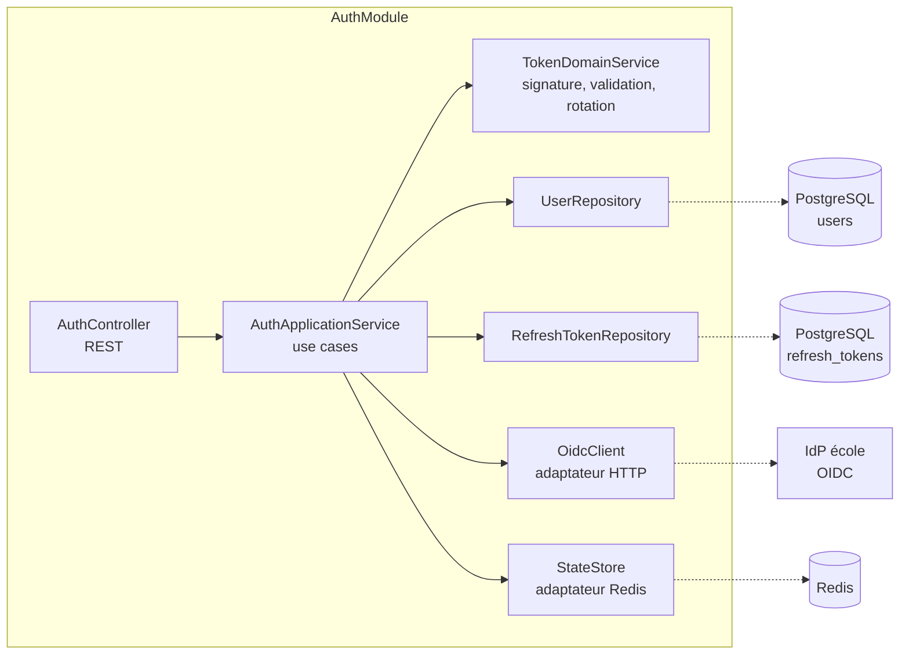
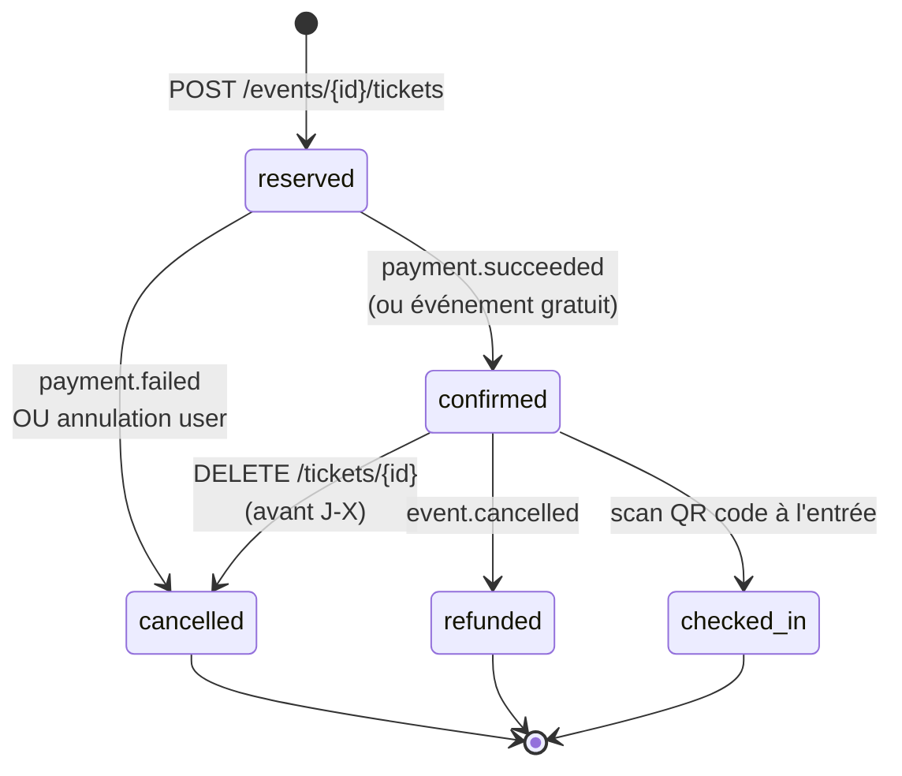
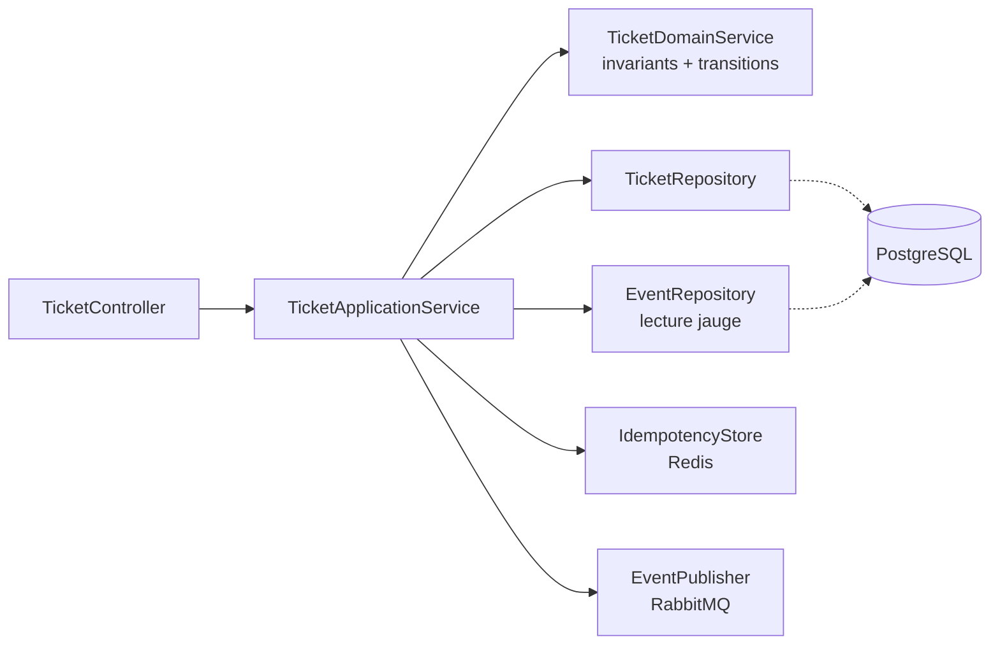
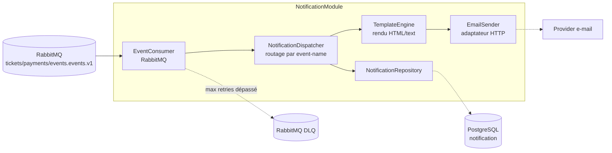

## §7 — Conception détaillée par module

##### Fait par Tom LEPRIEUR, Arthur L'AFFETER et Tiago DA COSTA

La § 7 zoome à l'intérieur du découpage logique exposé en § 6.1. Trois modules sont détaillés ici : `AuthModule` (transverse), `TicketModule` (cœur métier transactionnel) et `NotificationModule` (orchestrateur asynchrone). Les trois autres modules du projet (`EventModule`, `PaymentModule`, `UserModule`) suivent la même structure et seront documentés en itération suivante. Toutes les valeurs numériques précises (TTL, timeouts, durées d'expiration, seuils de retry) sont des **hypothèses V1**, à confronter au CDC SupEvents et à régler après mesure en pré-production.

---

### §7.1 — `AuthModule`

#### Responsabilité

Authentifier les utilisateurs SupEvents via le SSO école (OpenID Connect), émettre les jetons applicatifs (`access_token` JWT court + `refresh_token` opaque rotatif) et propager le contexte d'autorisation (rôle `user` / `organizer` / `admin`) à toute la chaîne d'appels.

#### Contrat d'interface

**Endpoints REST exposés** (cf. § 8) :

- `POST /api/v1/auth/oidc/callback` — réception du `code` OIDC, échange contre les jetons applicatifs.
- `POST /api/v1/auth/refresh` — rotation d'un refresh token contre une nouvelle paire de jetons.
- `POST /api/v1/auth/logout` — révocation du refresh token courant.

**Événements publiés** : aucun en V1 (audit géré par les logs structurés ; un `user.signed_in` pourra être ajouté ultérieurement si l'analytique le requiert).

**Événements consommés** : aucun.

**Appels sortants** :

- IdP école (OIDC) — flux Authorization Code + PKCE en HTTPS, échange du code, récupération de l'`id_token` et du `userinfo`.
- PostgreSQL — lecture/écriture sur les entités `User` et `RefreshToken` (cf. § 6.4).
- Redis — stockage des `state` OIDC anti-CSRF (TTL court, hypothèse V1 quelques minutes), liste de révocation des `jti` JWT en cas de logout forcé.

#### Architecture interne



Découpage hexagonal : le noyau (`TokenDomainService`) porte la logique de signature/validation et ne dépend d'aucune brique technique. Les adaptateurs `OidcClient` et `StateStore` sont mockables en tests d'intégration sans démarrer Redis ou l'IdP réel.

#### Algorithme critique : flow OIDC complet (callback)

```
fonction handleOidcCallback(code, state):
    # 1. Validation anti-CSRF : le state doit avoir été émis par nous
    storedState = stateStore.consume(state)            # GET + DEL atomique
    si storedState est absent ou expiré:
        lever AuthError("INVALID_STATE")               # 401

    # 2. Échange du code contre les jetons IdP (Authorization Code + PKCE)
    tokenSet = oidcClient.exchangeCode(code, storedState.codeVerifier)
    si tokenSet.echec:
        lever AuthError("OIDC_EXCHANGE_FAILED")        # 502

    # 3. Validation de l'id_token : signature, audience, expiration, nonce
    claims = tokenDomainService.validateIdToken(tokenSet.idToken)
    si claims.invalides:
        lever AuthError("INVALID_ID_TOKEN")            # 401

    # 4. Provisioning paresseux : créer le User si inconnu (premier login école)
    user = userRepository.findByEmail(claims.email)
    si user est absent:
        user = userRepository.create({
            email: claims.email,
            firstName: claims.given_name,
            lastName: claims.family_name,
            role: "user",
            emailVerified: true                         # déjà vérifié par IdP
        })

    # 5. Émission de la paire applicative
    accessToken = tokenDomainService.issueAccessToken(user)   # courte durée
    refreshToken = tokenDomainService.issueRefreshToken(user) # plus longue durée
    refreshTokenRepository.save(refreshToken.hash, user.id, refreshToken.expiresAt)

    # 6. Pose des cookies HttpOnly + Secure + SameSite=Strict
    retourner {
        accessToken: accessToken.value,
        refreshToken: refreshToken.value
    }
```

Décisions documentées par cet algorithme :

- **PKCE obligatoire**, même côté serveur, pour neutraliser une fuite éventuelle du `code` dans les logs intermédiaires.
- **Provisioning paresseux** : le compte est créé au premier login école plutôt qu'imposer une pré-inscription manuelle — choix justifié par le contexte universitaire (annuaire école = source de vérité).
- **Hash SHA-256 du refresh token en base**, jamais la valeur brute (cohérent avec § 6.4 entité `RefreshToken`).
- **Rotation systématique du refresh token à chaque usage** ; le précédent est révoqué dès qu'un nouveau est émis (cf. ADR-003).

#### Gestion des erreurs

| Code interne          | Cause                                                            | Comportement                                                            | Code HTTP               |
|-----------------------|------------------------------------------------------------------|-------------------------------------------------------------------------|-------------------------|
| `INVALID_STATE`       | `state` OIDC absent ou expiré (replay ou attaque CSRF)            | Aucune émission de jeton. Log de sécurité.                              | 401 Unauthorized        |
| `OIDC_EXCHANGE_FAILED`| IdP école indisponible ou code invalide                          | Aucune émission de jeton. Retry possible côté client après délai.       | 502 Bad Gateway         |
| `INVALID_ID_TOKEN`    | Signature, audience ou expiration de l'`id_token` invalide       | Aucune émission. Alerte sécurité si récurrent (attaque potentielle).    | 401 Unauthorized        |
| `REFRESH_TOKEN_REUSE` | Réutilisation d'un refresh token déjà rotaté                     | Révocation totale de la famille de tokens du user. Force re-login.       | 401 Unauthorized        |
| `ACCOUNT_DISABLED`    | Compte révoqué par un admin                                      | Aucune émission, message générique côté client.                         | 403 Forbidden           |

#### Cas limites

**Cas limite : utilisateur inconnu au premier login école.**
Un étudiant inscrit dans l'annuaire école n'a jamais ouvert SupEvents.
*Décision retenue :* provisioning automatique côté `AuthApplicationService` à partir des claims `userinfo`, avec rôle par défaut `user`. Aucune action manuelle requise.

**Cas limite : refresh token volé puis utilisé en parallèle par l'attaquant et la victime.**
Détection possible : un même refresh token déjà rotaté est présenté.
*Décision retenue :* à la première détection de réutilisation, **révocation de toute la famille** de refresh tokens du user (mécanisme « refresh token reuse detection ») — le légitime et l'attaquant sont tous deux déconnectés, l'utilisateur doit se ré-authentifier via OIDC. Compromis assumé entre sécurité et UX.

#### Décisions structurantes

- Voir **ADR-003** sur le choix JWT stateless court + refresh token rotatif plutôt que sessions serveur via Redis.

---

### §7.2 — `TicketModule`

#### Responsabilité

Gérer le cycle de vie d'un billet (`reserved → confirmed → cancelled / refunded / checked_in`), garantir l'allocation cohérente sur la jauge limitée de l'événement, et publier les événements métier consommés par les autres modules (notification, paiement, dashboard organisateur).

#### Contrat d'interface

**Endpoints REST exposés** (cf. § 8) :

- `POST /api/v1/events/{eventId}/tickets` — réservation d'un billet, état initial `reserved`.
- `GET /api/v1/tickets` — liste des billets de l'utilisateur courant.
- `GET /api/v1/tickets/{ticketId}` — détail d'un billet.
- `DELETE /api/v1/tickets/{ticketId}` — annulation par le détenteur.

**Événements publiés** sur l'exchange `tickets.events.v1` (cf. § 8) :

- `ticket.confirmed` — quand un billet bascule en `confirmed` (gratuit ou paiement Stripe capturé).
- `ticket.cancelled` — quand un billet bascule en `cancelled` (annulation utilisateur ou échec paiement).

**Événements consommés** :

- `payment.succeeded` (sur `payments.events.v1`) → bascule du billet de `reserved` vers `confirmed`.
- `payment.failed` (sur `payments.events.v1`) → bascule du billet de `reserved` vers `cancelled`, libération de la place.
- `event.cancelled` (sur `events.events.v1`) → bascule en masse de tous les billets `reserved`/`confirmed` vers `refunded`, déclenchement du remboursement Stripe.

**Appels sortants** :

- PostgreSQL — entités `Ticket`, `Event` (lecture jauge), `Payment` (création).
- Redis — clés d'idempotence sur les requêtes de réservation, verrous distribués sur la promotion de liste d'attente.
- RabbitMQ — publication des événements ci-dessus.

#### Architecture interne et machine à états



Découpage interne du module :



#### Algorithme critique : réservation concurrente sur la dernière place

Le scénario critique est l'arrivée concurrente de N requêtes sur la dernière place disponible. Le pseudo-code ci-dessous applique la stratégie retenue (cf. ADR-001).

```
fonction reserveTicket(userId, eventId, idempotencyKey):
    # 1. Idempotence : double-clic → renvoyer le résultat de la 1re tentative
    si idempotencyKey présent:
        cached = idempotencyStore.get("reserve:" + idempotencyKey)
        si cached existe:
            retourner cached

    # 2. Transaction PostgreSQL avec verrou pessimiste sur la ligne Event
    DEBUT TRANSACTION SERIALIZABLE
        evt = SELECT * FROM event WHERE id = eventId FOR UPDATE
        si evt.status != "published":
            ROLLBACK
            lever ConflictError("EVENT_NOT_OPEN")        # 409

        # 3. Vérification de la jauge
        confirmed_count = SELECT COUNT(*) FROM ticket
                          WHERE event_id = eventId
                          AND status IN ('reserved','confirmed','checked_in')
        si confirmed_count >= evt.capacity:
            ROLLBACK
            # File d'attente : option à activer si l'organisateur l'a configurée
            si evt.waitingListEnabled:
                ajouterFileAttente(userId, eventId)
                lever ConflictError("EVENT_FULL_QUEUED") # 409 + position file
            sinon:
                lever ConflictError("EVENT_FULL")        # 409

        # 4. Anti double-réservation utilisateur (cohérent avec § 6.4)
        existing = SELECT * FROM ticket
                   WHERE user_id = userId AND event_id = eventId
                   AND status NOT IN ('cancelled','refunded')
        si existing existe:
            ROLLBACK
            lever ConflictError("TICKET_DUPLICATE")      # 409

        # 5. Création du ticket en statut reserved
        ticket = INSERT INTO ticket (..., status='reserved') RETURNING *
    COMMIT

    # 6. Mémoriser la clé d'idempotence (TTL hypothèse V1 quelques heures)
    si idempotencyKey présent:
        idempotencyStore.set("reserve:" + idempotencyKey, ticket, ttl)

    # 7. Si événement gratuit : confirmation immédiate + publication
    si evt.priceCents == 0:
        ticketDomainService.confirm(ticket)
        publisher.publish("ticket.confirmed", buildPayload(ticket, "free"))
    # Sinon : le client appelle ensuite POST /tickets/{id}/payment-intent
    # et la confirmation viendra du consommateur de payment.succeeded

    retourner ticket
```

Décisions documentées par cet algorithme :

- **Verrou pessimiste `SELECT ... FOR UPDATE` sur la ligne `Event`** plutôt que verrou optimiste avec retry — choix justifié dans **ADR-001**.
- **Idempotence par clé client** (en-tête `Idempotency-Key`) plutôt que déduplication serveur — choix justifié dans **ADR-002**.
- La contrainte `UNIQUE (user_id, event_id) WHERE status NOT IN ('cancelled','refunded')` (cf. § 6.4) sert de garde-fou ultime même en cas de bug applicatif.
- La promotion de la file d'attente est un mécanisme distinct (consommateur de `payment.failed` / `ticket.cancelled`), pas géré dans cette transaction.

#### Gestion des erreurs

| Code interne         | Cause                                                                        | Comportement                                                          | Code HTTP               |
|----------------------|------------------------------------------------------------------------------|-----------------------------------------------------------------------|-------------------------|
| `EVENT_NOT_OPEN`     | Événement en statut `draft`, `closed` ou `cancelled`                          | Aucune réservation. Message explicite côté client.                    | 409 Conflict            |
| `EVENT_FULL`         | Jauge atteinte, file d'attente non activée                                   | Aucune réservation. Suggestion alternative côté UI.                   | 409 Conflict            |
| `EVENT_FULL_QUEUED`  | Jauge atteinte, mais utilisateur ajouté à la `WaitingListEntry`              | Position rendue dans la réponse.                                      | 409 Conflict + body     |
| `TICKET_DUPLICATE`   | L'utilisateur a déjà un billet actif (`reserved`/`confirmed`) sur cet event   | Aucune création. Renvoie l'id du ticket existant.                     | 409 Conflict            |
| `STRIPE_UNAVAILABLE` | Création du PaymentIntent échouée (dépendance externe)                        | Ticket reste en `reserved`, retry idempotent côté client autorisé.    | 502 Bad Gateway         |
| `IDEMPOTENCY_REPLAY` | Même `Idempotency-Key` avec corps différent                                  | Aucune création. Erreur explicite.                                    | 422 Unprocessable Entity|

#### Cas limites

**Cas limite : double-clic sur « S'inscrire ».**
Le bouton n'est pas désactivé après le premier clic ou la requête est rejouée par le navigateur.
*Décision retenue :* idempotence par en-tête `Idempotency-Key` généré côté client (UUID v4) — la deuxième requête renvoie le résultat de la première sans créer de doublon (cf. ADR-002).

**Cas limite : annulation après confirmation et après paiement capturé.**
L'utilisateur clique sur « Annuler mon billet » alors que Stripe a déjà capturé le paiement.
*Décision retenue :* l'annulation est acceptée tant que la date `event.starts_at - délai_remboursement` n'est pas dépassée (délai à figer en § 7 ; **hypothèse V1 : 48 h avant l'événement, à valider métier**). Le module publie `ticket.cancelled`, et le `PaymentModule` reçoit l'événement et déclenche le remboursement Stripe.

**Cas limite : événement annulé par l'organisateur alors que des billets sont confirmés.**
*Décision retenue :* sur réception de `event.cancelled`, le module bascule tous les billets `reserved`/`confirmed` en `refunded`, publie `ticket.cancelled` pour chaque billet, et délègue le remboursement au `PaymentModule`. Pas de remboursement géré ici (séparation des responsabilités).

#### Décisions structurantes

- Voir **ADR-001** sur la stratégie de gestion de la concurrence (verrou pessimiste).
- Voir **ADR-002** sur la stratégie d'idempotence (clé client).

---

### §7.3 — `NotificationModule`

#### Responsabilité

Diffuser les notifications utilisateurs (e-mail en V1, SMS et push en V2) déclenchées par les événements métier des autres modules, en respectant la politique de retry sur échec d'envoi et en garantissant qu'aucun message ne soit perdu silencieusement.

#### Contrat d'interface

**Endpoints REST exposés** : aucun en V1 (le module est purement asynchrone). Une API d'administration `GET /api/v1/admin/notifications` pourra être ajoutée pour l'observabilité.

**Événements publiés** :

- `notification.sent` (interne, optionnel) — pour audit, à activer si nécessaire en V2.

**Événements consommés** :

- `ticket.confirmed` (sur `tickets.events.v1`) → e-mail de confirmation + PDF du billet en pièce jointe.
- `payment.failed` (sur `payments.events.v1`) → e-mail d'échec avec lien de relance.
- `event.cancelled` (sur `events.events.v1`) → e-mail d'annulation à tous les détenteurs de billets.
- `organizer.validated` / `organizer.revoked` → e-mail de notification administrative à l'organisateur.

**Appels sortants** :

- Provider e-mail (hypothèse V1 : SendGrid, à figer en § 10) — API HTTPS.
- PostgreSQL — entités `Notification` (traçabilité), `User` (lecture e-mail destinataire), `Ticket`/`Event` (contexte du message).
- S3 — lecture des PDF de billets générés par le `TicketModule`.

#### Architecture interne



Le `Dispatcher` route les événements entrants vers les templates appropriés via une table de mapping (`event-name + version → template-code`). Cette indirection rend le module ouvert à de nouveaux templates sans modification du code des autres modules.

#### Algorithme critique : envoi avec retry et bascule DLQ

```
fonction onEvent(message):
    eventId = message.headers["x-event-id"]
    eventName = message.headers["x-event-name"]

    # 1. Idempotence du consommateur
    si notificationRepository.existsByEventId(eventId):
        ack(message)                                     # déjà traité
        retourner

    # 2. Routage vers le template
    templateCode = dispatcher.resolve(eventName, message.headers["x-event-version"])
    si templateCode est absent:
        log.warn("NO_TEMPLATE_FOR_EVENT", eventName)
        ack(message)                                     # ignore : pas d'erreur
        retourner

    # 3. Hydratation du contexte (lecture user, event, ticket selon le payload)
    contexte = contextBuilder.build(message.payload)
    si contexte.user.email est invalide:
        notificationRepository.save(status="failed", reason="INVALID_EMAIL")
        ack(message)                                     # skip silencieux loggé
        retourner

    # 4. Rendu et envoi
    notif = notificationRepository.create(status="queued", eventId, templateCode)
    essayer:
        rendered = templateEngine.render(templateCode, contexte)
        sender.send(contexte.user.email, rendered)
        notificationRepository.update(notif.id, status="sent", sentAt=now())
        ack(message)
    en cas d'erreur transitoire e:                      # 5xx provider, timeout
        notificationRepository.update(notif.id, status="failed")
        nack(message, requeue=true)                     # broker rejoue selon politique
    en cas d'erreur définitive e:                       # bounce hard, e-mail inexistant
        notificationRepository.update(notif.id, status="bounced")
        ack(message)                                    # ne pas rejouer
```

Décisions documentées par cet algorithme :

- **Idempotence par `x-event-id`** côté consommateur (cohérent avec § 8 — at-least-once).
- **Distinction transitoire / définitif** : un bounce hard (e-mail inexistant) consomme le message sans rejeu ; un 5xx provider rejoue selon la politique RabbitMQ.
- **Politique de retry** : backoff exponentiel avec jitter sur plusieurs paliers ; nombre maximal de tentatives à régler en exploitation (**hypothèse V1 ≈ 5**, cf. § 8). Au-delà, message en DLQ et alerte exploitation.
- **Contenu du message non stocké** : seul le `template_code` est conservé en base (cohérent avec § 6.4 stratégie RGPD `Notification`).

#### Gestion des erreurs

| Code interne          | Cause                                                                  | Comportement                                                              | Code HTTP / canal       |
|-----------------------|------------------------------------------------------------------------|---------------------------------------------------------------------------|-------------------------|
| `NO_TEMPLATE_FOR_EVENT`| `event-name` reçu sans template mappé                                  | Acknowledge silencieux + log warning. Pas d'erreur consommateur.          | n/a (asynchrone)        |
| `INVALID_EMAIL`       | Adresse e-mail destinataire invalide ou vide                          | `Notification.status = failed`, raison loggée. Pas de rejeu.              | n/a (asynchrone)        |
| `PROVIDER_5XX`        | Provider e-mail temporairement indisponible                           | Rejeu selon politique broker (backoff + max tentatives, puis DLQ).        | n/a → DLQ après seuil   |
| `HARD_BOUNCE`         | Adresse rejetée définitivement par le serveur destinataire             | `Notification.status = bounced`. Pas de rejeu. User flaggé pour audit.    | n/a (asynchrone)        |
| `RATE_LIMITED_PROVIDER`| Provider e-mail répond 429                                            | Rejeu après `Retry-After`, ou bascule provider secondaire si configuré.   | n/a → retry             |

#### Cas limites

**Cas limite : provider e-mail totalement indisponible pendant > 1 h.**
SendGrid (ou équivalent) retourne 5xx en continu.
*Décision retenue :* la file `notifications.email` se remplit, les messages basculent en DLQ après le nombre maximal de tentatives. Une alerte exploitation se déclenche sur le taux de remplissage de la DLQ. Un mécanisme de bascule vers un provider secondaire est documenté comme **option V2** (non implémentée en V1).

**Cas limite : e-mail utilisateur invalide ou vide (compte créé via OIDC sans claim `email`).**
Cas théoriquement impossible vu la contrainte `NOT NULL` sur `User.email`, mais la défense en profondeur impose la vérification.
*Décision retenue :* `Notification.status = failed`, raison `INVALID_EMAIL`, log structuré pour audit. Aucun rejeu.

**Cas limite : événement reçu deux fois (replay broker au-delà du TTL d'idempotence).**
Le broker peut, dans des cas dégradés, re-livrer un message après expiration de la clé de déduplication.
*Décision retenue :* la requête `notificationRepository.existsByEventId(eventId)` reste la source de vérité — la clé Redis n'est qu'un cache rapide ; PostgreSQL tranche en cas de doute.

#### Décisions structurantes

- Le choix du provider e-mail (SendGrid en hypothèse V1) sera tranché par un ADR dédié en itération suivante.
- La politique de retry et de DLQ s'appuie sur les conventions transverses § 8.

---

### Cohérence avec § 6.4 et § 8

| Vérification                                                                                                                    | État |
|---------------------------------------------------------------------------------------------------------------------------------|------|
| Toutes les entités manipulées (`User`, `RefreshToken`, `Event`, `Ticket`, `Payment`, `Notification`, `WaitingListEntry`) figurent au dictionnaire § 6.4 | OK   |
| Tous les endpoints listés dans les contrats d'interface figurent au tableau synoptique § 8                                      | OK   |
| Tous les événements publiés/consommés (`ticket.confirmed`, `ticket.cancelled`, `payment.succeeded`, `payment.failed`, `event.cancelled`) sont documentés ou prévus § 8 | OK (ticket.cancelled à compléter en § 8 lors de l'itération suivante) |
| Les codes HTTP des tableaux d'erreurs (409, 422, 502, 401, 403) sont cohérents avec les codes annoncés au tableau synoptique § 8 | OK   |
