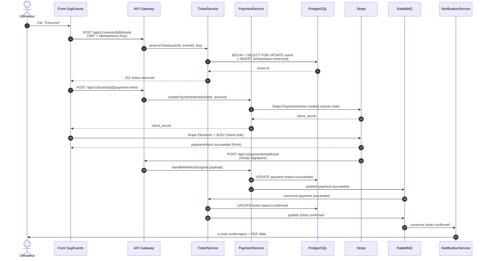
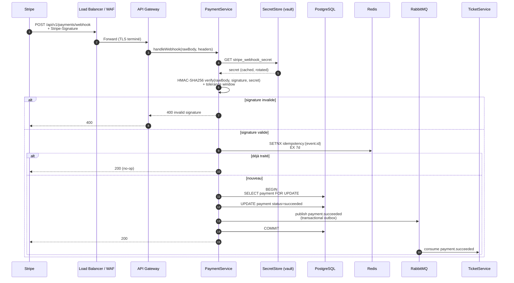

## §9 — Exigences transverses

##### Fait par Tom LEPRIEUR, Arthur L'AFFETER et Tiago DA COSTA

Cette section rassemble les exigences qui ne se rattachent pas à une fonctionnalité métier précise mais qui pèsent sur l'ensemble du système : sécurité, performance, conformité RGPD. Toutes les valeurs numériques précises (latences cibles, taux d'erreur, durées de rétention, fenêtres de retry) sont des **hypothèses V1**, à confronter aux exigences ENF du CDC SupEvents et à régler après mesure en pré-production.

---

### §9.1 — Sécurité (analyse STRIDE)

L'analyse STRIDE est appliquée aux deux flux critiques retenus : le flux d'inscription payante (chemin nominal côté utilisateur) et le flux de réception du webhook Stripe (chemin nominal côté tiers). Un troisième flux (authentification SSO) est couvert indirectement par la fiche `AuthModule` § 7.1 et l'ADR-003 ; son analyse STRIDE complète sera produite en itération suivante.

#### §9.1.1 — Flux 1 : Inscription payante

Le flux engage trois domaines de confiance distincts : le navigateur de l'utilisateur (zone non maîtrisée), notre infrastructure backend (zone maîtrisée), et Stripe (zone tiers de confiance contractuelle). Le montant payé n'est jamais transmis depuis le client : il est calculé serveur-side à partir du couple `(eventId, ticketId)` et persisté avant création du PaymentIntent. Le client pilote le tunnel 3DS2 via Stripe Elements, mais ne voit jamais la donnée carte — celle-ci est tokenisée chez Stripe. La confirmation finale du billet ne dépend pas de la réponse front du SDK Stripe (qui peut être perdue), mais de la réception du webhook signé HMAC : c'est la seule source de vérité du statut du paiement. La publication de `ticket.confirmed` sur RabbitMQ déclenche la notification asynchrone, isolant le chemin transactionnel critique du chemin de communication utilisateur.

| Menace                       | Risque identifié                                                                                                                            | Mesure de défense retenue                                                                                                                                                                                                                                                              |
|------------------------------|---------------------------------------------------------------------------------------------------------------------------------------------|----------------------------------------------------------------------------------------------------------------------------------------------------------------------------------------------------------------------------------------------------------------------------------------|
| **S — Spoofing**             | Un attaquant rejoue un access token JWT volé pour réserver/payer à la place d'un utilisateur légitime.                                       | JWT court (hypothèse V1 ≤ 15 min, cf. ADR-003), signature RS256 vérifiée côté API Gateway, denylist Redis sur les `jti` révoqués. Cookie refresh `HttpOnly + Secure + SameSite=Strict`. Détection de réutilisation du refresh token (cf. § 7.1) → révocation totale de la famille.    |
| **T — Tampering**            | Le montant à payer est modifié côté client (DOM, proxy intermédiaire) avant création du PaymentIntent.                                       | Le montant n'est jamais transmis depuis le client : `PaymentService` recalcule `amount_cents` serveur-side à partir de `Event.price_cents` (cf. § 6.4) et le passe à `Stripe.PaymentIntents.create`. TLS 1.2+ obligatoire bout en bout. HSTS strict.                                    |
| **R — Repudiation**          | Un utilisateur conteste avoir réservé/payé un billet (« je n'ai jamais cliqué »).                                                            | Journalisation horodatée UTC append-only de chaque transition d'état (`reserved`, `confirmed`, `cancelled`) avec `user_id`, `ticket_id`, `payment_intent_id`, IP, user-agent, `traceId` W3C. Logs centralisés en stack d'observabilité (cf. § 10) avec rétention auditée.              |
| **I — Information Disclosure**| Fuite de données carte bancaire ou de PII utilisateur via les logs/erreurs/réponses API.                                                   | **Aucune donnée carte** stockée ni transitée par nos serveurs (PCI-DSS délégué Stripe via Stripe Elements + 3DS2, cf. § 6.4 entité `Payment`). PII utilisateur jamais incluse dans les payloads d'événements RabbitMQ (uniquement des `id`). Filtres de redaction dans les logs.        |
| **D — Denial of Service**    | Botnet inonde l'endpoint `POST /events/{id}/tickets` pour saturer le verrou pessimiste sur l'événement et bloquer les inscriptions légitimes. | Rate limiting par IP et par utilisateur (valeurs § 8 — hypothèse V1). WAF/CDN en amont rejetant les patterns abusifs. Pool de connexions PostgreSQL dimensionné, timeout serveur strict sur `SELECT FOR UPDATE`. Bucket Redis de tokens d'inscription par event sur les rushs anticipés. |
| **E — Elevation of Privilege**| Un utilisateur appelle directement `POST /tickets/{ticketId}/payment-intent` sur un `ticketId` qui ne lui appartient pas.                  | API Gateway vérifie la cohérence `JWT.sub == ticket.user_id` avant délégation à `PaymentService`. Refus 403 sinon, log de sécurité. Contrôle redoublé côté `PaymentService` (défense en profondeur).                                                                                  |

#### §9.1.2 — Flux 2 : Réception webhook Stripe

Le webhook Stripe est le canal critique par lequel notre système apprend qu'un paiement a réussi ou échoué. Il est exposé publiquement (Stripe doit pouvoir l'atteindre depuis Internet) mais authentifié exclusivement par signature HMAC-SHA256 calculée sur le corps brut de la requête, avec une fenêtre de tolérance temporelle pour bloquer les replays anciens. La déduplication s'appuie sur `event.id` Stripe (déjà unique côté Stripe) stocké en Redis avec TTL adapté à la fenêtre de retry Stripe (hypothèse V1 ≈ 7 jours). La mise à jour du `Payment` et la publication de `payment.succeeded` se font dans la même transaction PostgreSQL via le pattern outbox, garantissant qu'aucun événement n'est perdu en cas de crash entre `UPDATE` et `publish`. Le webhook ne lit aucun contexte utilisateur : il est strictement isolé du reste de l'API.

| Menace                       | Risque identifié                                                                                                                          | Mesure de défense retenue                                                                                                                                                                                                                                                                          |
|------------------------------|-------------------------------------------------------------------------------------------------------------------------------------------|----------------------------------------------------------------------------------------------------------------------------------------------------------------------------------------------------------------------------------------------------------------------------------------------------|
| **S — Spoofing**             | Un attaquant forge un faux POST se faisant passer pour Stripe pour valider un paiement non effectué.                                        | Vérification obligatoire de l'en-tête `Stripe-Signature` par HMAC-SHA256 sur le corps **brut** (pas après parsing). Secret webhook stocké en vault (HashiCorp Vault ou équivalent — hypothèse V1, cf. § 10). Toute requête sans signature valide → 400 immédiat avant tout traitement métier.    |
| **T — Tampering**            | L'attaquant intercepte un webhook légitime et modifie le payload (montant, statut) avant qu'il nous parvienne.                              | TLS 1.2+ obligatoire sur le endpoint webhook (HSTS). Signature HMAC calculée sur le corps brut → toute modification post-signature invalide la vérification. Pinning d'IP Stripe (allowlist au niveau WAF) en option défense en profondeur.                                                       |
| **R — Repudiation**          | Stripe nie avoir envoyé un webhook que nous avons traité (ou inversement).                                                                 | Conservation du payload brut signé + en-têtes (dont `Stripe-Signature` et `event.id`) pendant 90 jours minimum (hypothèse V1) en log append-only. Chaque traitement est tracé (`event.id`, `payment_id`, statut avant/après, `traceId`). Possibilité de replay manuel depuis le dashboard Stripe. |
| **I — Information Disclosure**| Le payload webhook (qui contient des métadonnées Stripe) fuit via les logs ou un message d'erreur trop verbeux.                          | Redaction stricte dans les logs : seuls `event.id`, `event.type`, `payment_intent_id` sont loggés en clair. Le payload complet n'est conservé qu'en zone d'audit chiffrée à accès restreint. Réponses 4xx/5xx au webhook ne contiennent aucune donnée Stripe.                                     |
| **D — Denial of Service**    | Saturation de l'endpoint webhook par requêtes massives (légitimes Stripe ou malveillantes) bloquant le traitement des paiements réels.    | Rate limiting permissif sur l'endpoint (Stripe peut envoyer en rafale lors d'incidents — calibrer pour ne pas filtrer Stripe). Traitement asynchrone : le handler répond rapidement 200 après écriture en outbox, le travail réel est fait par un worker. Backpressure sur le pool RabbitMQ.       |
| **E — Elevation of Privilege**| Un attaquant qui aurait obtenu accès à un compte utilisateur tente d'appeler `/payments/webhook` directement pour valider son paiement. | Le endpoint **n'accepte aucun JWT** : il rejette même les requêtes authentifiées si elles n'ont pas la signature `Stripe-Signature` valide. Le code ne lit aucune information de contexte utilisateur — il opère uniquement sur le `payment_intent_id` extrait du payload signé.                  |

---

### §9.2 — Performance

Trois exigences sont posées en hypothèse V1 (à confronter aux ENF chiffrées du CDC SupEvents). Chaque exigence est formulée selon le format à quatre dimensions : objectif mesurable, solution technique, composant impacté, méthode de vérification.

#### Exigence ENF-PERF-01 — Latence de l'inscription à un événement

| Dimension                | Contenu                                                                                                                                                                                                                                                                                                                                  |
|--------------------------|------------------------------------------------------------------------------------------------------------------------------------------------------------------------------------------------------------------------------------------------------------------------------------------------------------------------------------------|
| **Objectif mesurable**   | Le temps de réponse de `POST /api/v1/events/{eventId}/tickets` doit rester **inférieur à 500 ms au p95**, mesuré sur fenêtre glissante de 5 minutes, sous une charge cible de **500 utilisateurs concurrents** simulés (hypothèse V1, à aligner sur ENF-01 du CDC).                                                                       |
| **Solution technique**   | Verrou pessimiste sur la ligne `Event` au lieu de scan complet (cf. ADR-001). Index PostgreSQL `idx_ticket_event_status (event_id, status)` pour le comptage des billets actifs (cf. § 6.4). Pool de connexions PostgreSQL dimensionné en exploitation. Cache Redis du `Event` (lecture seule, TTL court) pour la pré-vérification du statut. Idempotence Redis pour neutraliser les doublons sans réexécution (cf. ADR-002). |
| **Composant impacté**    | `TicketModule` (§ 7.2), couche persistance PostgreSQL, Redis (cache + idempotence).                                                                                                                                                                                                                                                       |
| **Méthode de vérification** | Tests de charge automatisés en pré-production via **k6** (ou Gatling — choix outillage à figer en § 10), scénario « rush sur dernière place » exécuté à chaque release candidate. Monitoring continu en production via Prometheus + Grafana, alerte si p95 > 500 ms pendant 10 minutes consécutives.                                  |

#### Exigence ENF-PERF-02 — Disponibilité mensuelle de la plateforme

| Dimension                | Contenu                                                                                                                                                                                                                                                                                                                                                                                                |
|--------------------------|--------------------------------------------------------------------------------------------------------------------------------------------------------------------------------------------------------------------------------------------------------------------------------------------------------------------------------------------------------------------------------------------------------|
| **Objectif mesurable**   | Disponibilité mensuelle ≥ **99,5 %** des endpoints publics (`/api/v1/events*`, `/api/v1/auth/*`), mesurée hors fenêtres de maintenance planifiées et annoncées au moins 48 h à l'avance (hypothèse V1, alignement ENF-02 CDC).                                                                                                                                                                          |
| **Budget d'erreur**      | 99,5 % d'un mois de 30 jours = 30 × 24 × 60 × 0,005 = **216 minutes d'indisponibilité tolérée par mois** (≈ **3 h 36 min**). Ce budget est consommé par les déploiements, les incidents et les maintenances non planifiées. Au-delà, freeze des déploiements non critiques.                                                                                                                                |
| **Solution technique**   | Déploiement multi-zones disponibilité (au moins 2 AZ). Kubernetes avec `PodDisruptionBudget` minimum 1 replica par service. PostgreSQL en mode primaire/réplique avec failover automatique. RabbitMQ en cluster 3 nœuds avec quorum queues. Stratégie de release **rolling update** sans interruption + smoke tests post-déploiement. Healthchecks `/healthz` et `/readyz` consommés par le load balancer. |
| **Composant impacté**    | Tous les modules backend (responsabilité de l'équipe SRE/exploitation), infrastructure Kubernetes, PostgreSQL, RabbitMQ, Redis.                                                                                                                                                                                                                                                                          |
| **Méthode de vérification** | Sonde de disponibilité externe (Pingdom, UptimeRobot ou équivalent — choix § 10) toutes les 60 s sur trois endpoints publics. Calcul du taux mensuel publié sur dashboard Grafana. Revue post-mortem trimestrielle de la consommation du budget d'erreur.                                                                                                                                              |

#### Exigence ENF-PERF-03 — Capacité d'absorption d'un pic d'inscriptions

| Dimension                | Contenu                                                                                                                                                                                                                                                                                                                                       |
|--------------------------|-----------------------------------------------------------------------------------------------------------------------------------------------------------------------------------------------------------------------------------------------------------------------------------------------------------------------------------------------|
| **Objectif mesurable**   | Le système doit absorber **500 utilisateurs concurrents** émettant simultanément `POST /events/{id}/tickets` sur le même événement, sans dégradation du SLO de latence (cf. ENF-PERF-01) et sans erreur 5xx (taux d'erreur 5xx < 0,1 %). Hypothèse V1, alignement ENF-01 CDC.                                                                  |
| **Solution technique**   | Autoscaling horizontal (HPA Kubernetes) sur les services `TicketService` et `PaymentService`, déclenché sur CPU > 70 % ou file de requêtes > seuil. Pool de connexions PostgreSQL dimensionné pour absorber le burst sans saturation (PgBouncer en transaction pooling). File d'attente côté API Gateway (rate limiting permissif mais bornant). Mécanisme `WaitingListEntry` (cf. § 6.4) côté métier pour les rushs au-delà de la capacité. |
| **Composant impacté**    | `TicketModule` (§ 7.2), `PaymentModule` (à détailler en itération suivante), API Gateway, infrastructure (HPA + PgBouncer).                                                                                                                                                                                                                  |
| **Méthode de vérification** | Test de charge dédié en pré-production via k6, scénario `ramp-up 0 → 500 VU en 30 s, hold 5 min`. Critères de succès : p95 < 500 ms ET 5xx < 0,1 % ET taux de succès fonctionnel > 95 % (les 5 % restants peuvent être en file d'attente, ce qui est un succès produit). Test joué à chaque release candidate impactant `TicketModule`. |

---

### §9.3 — RGPD

#### a) Registre des traitements (extrait SupEvents)

| Donnée personnelle              | Finalité                                                                                  | Base légale                                            | Durée de rétention (hypothèse V1, à valider DPO) |
|---------------------------------|-------------------------------------------------------------------------------------------|--------------------------------------------------------|---------------------------------------------------|
| `User.email`                    | Authentification, contact transactionnel (confirmation, annulation, relance)              | Exécution du contrat (CGU SupEvents)                   | Durée de vie du compte + 36 mois après dernière activité |
| `User.first_name`, `User.last_name` | Personnalisation des communications, génération du PDF de billet, listes participants    | Exécution du contrat                                   | Idem `User.email`                                 |
| Identifiant SSO école (`sub` OIDC dans `User`) | Liaison du compte SupEvents avec l'annuaire école (source de vérité) | Exécution du contrat + intérêt légitime de l'établissement | Idem `User.email`                                 |
| Historique d'inscriptions (`Ticket`, `Event` associés) | Service rendu, statistiques organisateur (taux de remplissage, KPI) | Exécution du contrat                                   | 36 mois après la fin de l'événement (hypothèse, cf. § 6.4) |
| Identifiant customer Stripe (`stripe_payment_intent_id` dans `Payment`) | Traçabilité comptable, remboursement, lutte anti-fraude | Obligation légale (Code de commerce art. L123-22) + exécution du contrat | **10 ans** (obligation comptable) |
| Adresse IP + user-agent (logs applicatifs) | Sécurité (détection d'abus, audit), traçabilité des actions sensibles | Intérêt légitime (sécurité du SI) | 12 mois en stockage chaud, agrégation anonyme au-delà |
| `Organizer.siret`               | Vérification du statut juridique de l'organisateur                                        | Obligation légale (entreprise individuelle = donnée personnelle) | 10 ans après cessation du statut d'organisateur |

#### b) Mécanismes de protection transverses

- **TLS 1.2+ en transit** sur tous les endpoints (API publics, communications inter-services en mTLS recommandé en V2). HSTS strict sur les domaines publics.
- **Chiffrement de la base PostgreSQL au repos** au niveau volume (LUKS, EBS encryption ou équivalent selon hébergeur — choix § 10). Sauvegardes chiffrées avec clé distincte.
- **Hashage SHA-256 des refresh tokens** en base (cf. § 6.4 entité `RefreshToken`) — la valeur brute n'est jamais persistée. Hashage Argon2id ou équivalent OWASP des mots de passe applicatifs (si un jour pertinent — actuellement OIDC uniquement).
- **Gestion des secrets via vault** (HashiCorp Vault ou solution gérée — choix § 10) pour les secrets webhook Stripe, clés de signature JWT, secrets OIDC. Rotation périodique automatisée.
- **Séparation stricte des environnements** : production, pré-production, développement → données isolées, pas de copie de données réelles en pré-production sans anonymisation préalable.
- **Audit log append-only** des actions sensibles (login admin, validation/révocation d'organisateur, accès aux données d'un autre utilisateur par un admin) — conservation 5 ans, accès restreint, immutabilité contractualisée.
- **Filtres de redaction dans les logs applicatifs** : aucune valeur de cookie, aucun contenu de payload Stripe, aucune PII dans les messages d'erreur retournés au client.
- **Politique de moindre privilège** sur les accès base : comptes applicatifs avec droits granulaires par schéma, comptes humains nominatifs avec accès lecture seule par défaut, élévation à la demande tracée.

#### c) Procédures liées aux droits des personnes

##### Procédure 1 — Droit d'accès (article 15 RGPD)

| Item                  | Contenu                                                                                                                                                                              |
|-----------------------|--------------------------------------------------------------------------------------------------------------------------------------------------------------------------------------|
| Qui déclenche         | L'utilisateur, depuis son espace compte ou par e-mail au DPO (`dpo@supevents.fr`).                                                                                                    |
| Qui exécute           | `UserModule` (action automatisée pour un utilisateur connecté) ; le DPO en backoffice pour les demandes hors plateforme.                                                              |
| Délai contractuel     | **1 mois** maximum (article 12 §3 RGPD), prolongeable à 3 mois pour les demandes complexes avec notification préalable.                                                              |
| Format de livraison   | Archive ZIP contenant : un fichier `profile.json` (compte, préférences), un `tickets.csv` (historique), un `notifications.csv` (envois reçus), un `payments.csv` (références Stripe sans données carte). Téléchargement via lien signé S3 expirant en 7 jours. |
| Traces conservées     | Demande horodatée dans le registre interne, livraison tracée dans l'audit log, accusé de réception envoyé à l'utilisateur.                                                            |

##### Procédure 2 — Droit à l'oubli (article 17 RGPD)

| Item                  | Contenu                                                                                                                                                                              |
|-----------------------|--------------------------------------------------------------------------------------------------------------------------------------------------------------------------------------|
| Qui déclenche         | L'utilisateur depuis son espace compte (action « Supprimer mon compte » avec double confirmation), ou demande au DPO.                                                                |
| Qui exécute           | `UserModule` orchestre la séquence : appels en cascade aux autres modules pour traiter les références.                                                                                |
| Délai contractuel     | **1 mois** maximum, traitement asynchrone via job de purge.                                                                                                                          |
| Mécanisme retenu      | **Anonymisation par pseudonyme stable** plutôt que suppression dure : `User.email` → `deleted-{uuid}@anon.supevents`, `first_name`/`last_name` → `"Utilisateur"`/`"Supprimé"`. Les `Ticket`, `Payment`, `Notification` associés sont conservés pour intégrité référentielle et obligations comptables. Le pseudonyme stable permet à l'organisateur de continuer à voir « 1 participant supprimé » dans ses statistiques sans réidentification possible. |
| Données non supprimables | Les `Payment` (référence `stripe_payment_intent_id`, montant, date) sont conservés **10 ans** au titre de l'obligation comptable (Code de commerce art. L123-22). Ils ne contiennent aucune donnée nominative après anonymisation. Les `Ticket` `checked_in` (effectivement utilisés à un événement) sont conservés sans donnée nominative pour les KPI de l'organisateur. |
| Propagation tiers     | Suppression du `Customer` Stripe via `Stripe.customers.del()` lorsque tous les paiements associés sont au-delà de leur durée légale ; sinon, anonymisation des métadonnées Stripe. Désinscription des listes SendGrid (ou équivalent) via API. |
| Traces conservées     | Demande horodatée, séquence d'anonymisation détaillée dans l'audit log (sans valeurs nominatives), accusé final envoyé à l'utilisateur (à son ancienne adresse) avant fermeture définitive. |

##### Procédure 3 — Droit de rectification (article 16 RGPD)

| Item                  | Contenu                                                                                                                                                                              |
|-----------------------|--------------------------------------------------------------------------------------------------------------------------------------------------------------------------------------|
| Qui déclenche         | L'utilisateur depuis son espace compte (champs `first_name`, `last_name`, préférences de notification). L'`email` n'est pas modifiable directement (clé de l'identité OIDC école — modification via l'annuaire école). |
| Qui exécute           | `UserModule` côté applicatif. La propagation aux tiers est automatisée.                                                                                                              |
| Délai contractuel     | **Immédiat** côté SupEvents (transaction PostgreSQL synchrone). Propagation aux tiers dans les 24 h (asynchrone).                                                                    |
| Propagation aux tiers | Update du `Customer` Stripe (`name`) via `Stripe.customers.update()` déclenché par un événement interne `user.updated`. Update des contacts SendGrid (ou équivalent) via API. Aucune action manuelle requise. |
| Traces conservées     | Audit log de la modification : `user_id`, champs modifiés, valeurs avant/après hashées (pas en clair pour les champs sensibles), horodatage, IP source.                              |

---

*Dernière mise à jour : 2026-04-30*
